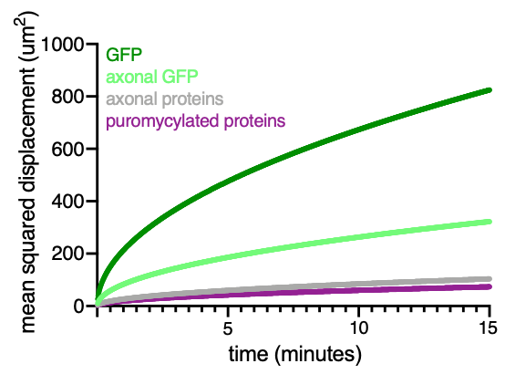

## Figure to accompany the annotation of Enam et al., eLIFE, 2020 from the Schuman Lab

### Comparing the mean-squared displacement of GFP, neuronal proteins and puromycylated peptides.

Mean squared displacement (MSD) was calculated for cytosolic GFP as in Enam et al. (dark green, 126.0 &mu;m2/s), cytosolic GFP in axons (light green, 19.2 &mu;m2/s), 45 axonal proteins  (grey line, 1.95 &mu;m2/s) or puromycylated peptides (Ge et al., 2016) (magenta, 0.9 &mu;m2/s) for 3D diffusion using the equation: x2 = 2nDt, (where n = number of dimensions, D = diffusion coefficient and t = time). Note that the MSD for cytosolic GFP in axons (Reshetniak et al., 2020) is much lower than the CHO cell-derived value used by Enam et al - but still several-fold higher than the MSD reported for puromycylated peptides measured in a neuronal-origin cell line (Ge, et al 2016).  The difference in GFP diffusion presumably reflects the molecular crowding differences in the two cellular environments. The lower MSD of puromycylated peptides is likely additionally influenced by protein-protein interaction domains present in nascent peptides. Consistent with this, the average MSD of 45 synaptic proteins in the axon (data taken from Reshetniak et al, 2020; is similar to that of puromycylated peptides. These plots show that puromycylated peptides in neurons diffuse much less than GFP in CHO cells and appear to behave like the “average” protein in an axonal/dendritic compartment- influenced by both the molecular crowding of the environment and protein-protein interactions.

### referennces

Enam et al., 2020.  Puromycin reactivity does not accurately localize translation at the subcellular level eLife. [doi.org/10.7554/eLife.60303](https://elifesciences.org/articles/60303)
 
 
Ge et al., 2016. Puromycin analogs capable of multiplexed imaging and profiling of protein synthesis and dynamics in live cells and neurons. Angewandte Chemie. [doi.org/10.1002/anie.201511030](https://onlinelibrary.wiley.com/doi/full/10.1002/anie.201511030)
 
 
Reshetniak et al., 2020. A comparative analysis of the mobility of 45 proteins in the synaptic bouton. The EMBO Journal. [doi.org/10.15252/embj.2020104596](https://www.embopress.org/doi/full/10.15252/embj.2020104596)

### annotation text

Using Green Fluorescent Protein (GFP) as a model for endogenous protein diffusion is not the most appropriate. In non-native cells, the diffusion of GFP is dominated by molecular crowding of its environment, as it likely does not have any endogenous interaction partners (e.g. aequorin). For example, the GFP diffusion values cited by Enam et al., (dark green line in attached Figure) derived from studies in CHO cells, are much faster than GFP diffusion values obtained in neuronal compartments like axons (light green line in Figure) (Reshetniak et al., 2020). In fact, and even better, there are direct data available on the diffusion of puromycylated peptides in a neuron-derived cell line (Ge et al., 2016) (purple line in Figure).  The diffusion of puromycylated peptides measured directly in Ge et al., is ~ 10-fold slower than the diffusion of cytosolic GFP shown in Figure 5 of Enam et al. In addition, many groups have directly studied the diffusion of neuronal proteins in mature neurons- and again found diffusion values that are much slower than cytosolic GFP in the same subcellular compartment (grey line in Figure). As such, we believe that puromycin, when used appropriately, can be used in neurons to ascertain or validate the location of nascent proteins in or near the compartment (axonal or dendritic) in which they were synthesized. Practically speaking, measurements should be made in distal processes (e.g. > 50 microns from the cell body) following short-labelling times (~ 5 min) using a low (~2 – 5 &mu;M) puromycin concentration– these are the typical parameters used by most experimenters, including our group.

